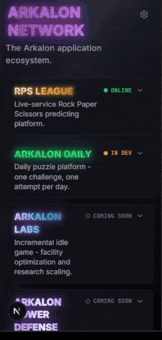

# 🌐 Arkalon Network

The central hub and identity platform for the **Arkalon application ecosystem**, connecting live-service games, simulations, and competitive experiences under a unified account system.

> **Ecosystem Evolution:** Following the full production rollout of [RPS League](https://rpsleague.fi/), development has expanded into the wider **Arkalon universe**. Arkalon Network acts as the anchor for all current and upcoming applications, synchronizing user identities, global telemetry, and session state across the ecosystem.

**Explore the Network:** [https://network.rpsleague.fi/](https://network.rpsleague.fi/)

## Preview

<p align="center">
  
</p>

---

## 🧩 Table of Contents
### 🧱 Core Systems
- [Arkalon Core: Unified Account System](#-arkalon-core-unified-account-system)
- [AI Arkalon: The Ecosystem Oracle & RAG Engine](#-ai-arkalon-the-ecosystem-oracle--rag-engine)
- [Onboarding & Transmission Modals](#-onboarding--transmission-modals)
- [Feedback & Moderation System](#-feedback--moderation-system)

### 🗂️ Ecosystem Directory
- [Active & In Development](#-active--in-development)
- [Future Experiences](#-future-experiences)
- [Status Lifecycle Engine](#-status-lifecycle-engine)
- [Application Registry & Discovery](#-application-registry--discovery)

### ⚙️ Engineering & Architecture
- [Architecture & Tech Stack](#-architecture--tech-stack)
- [System Data Flow](#-system-data-flow)
- [RAG Retrieval & Intelligence Pipeline](#-rag-retrieval--intelligence-pipeline)
- [Visual Shader & Typography Engine](#-visual-shader--typography-engine)
- [Cryptographic Session & Security Model](#-cryptographic-session--security-model)
- [Test Suite](#-test-suite)

### 📦 Meta
- [Device Compatibility](#-device-compatibility)
- [Disclaimer](#-disclaimer)
- [Privacy, Telemetry & Security](#-privacy-telemetry--security)
- [License](#-license)

---

## ⚡ Arkalon Core: Unified Account System

Arkalon Network introduces **Arkalon Core**, a zero-friction, local-first account system that eliminates traditional email and password registration entirely. Visiting any application within the network instantly provisions a secure, persistent identity that functions seamlessly across all subdomains.

- **Instant On-Arrival Provisioning**: The platform automatically provisions a unique UUID, HMAC session token, and encrypted credentials in the background on your very first page load, no signup forms or clicks required.
- **Deterministic 3-Word Nicknames**: Procedurally generated using a three-tier dictionary (Adjective + Color + Animal, e.g., `AncientGoldTurtle`), creating ~863,000 unique, readable combinations with zero namespace collisions.
- **On-Demand Nickname Rerolls**: Players can randomize their procedural handle at any time for free via the Settings panel with instant database synchronization (`rerollNicknameAction`). Custom typed inputs are disallowed to preserve universe flavor and prevent profanity.
- **Short ID Anchor**: Lightweight 10-character URL-safe identifiers (e.g., `Hqo7qUSe38`) derived from an unambiguous 54-character set, providing consistent public handles across leaderboards, profiles, and match history.
- **Mnemonic Recovery Phrases**: Alphanumeric, human-readable master keys (e.g., `SWIFT-CRYSTAL-8214`) generated cryptographically server-side from a 256-word curated dictionary (655M+ combinations) for cross-device migration and profile recovery.
- **Revealable Recovery Access**: Security-conscious UX where master recovery codes remain blurred behind real-time CSS filters until explicitly requested by verified sessions, featuring instant one-click clipboard copying.
- **Dual-Cookie Root SSO**: Authentication is split across root-domain (`.rpsleague.fi`) cookies:
  - `arkalon_core_id`: 1-year persistent anchor storing the public UUID.
  - `arkalon_session`: 30-day rolling session token, HMAC-signed with SHA-256 and verified in constant time before granting data access.

---

## 🤖 AI Arkalon: The Ecosystem Oracle & RAG Engine

> *"A forgotten intelligence from a lost era. It does not predict the future, it calculates the probability of what has already begun."*

The ecosystem features **Arkalon AI** (accessible at `/ai`), an in-universe prophetic intelligence overseer that acts as an analytical guide, rules arbitrator, and recommendation oracle across all network platforms.

- **True In-Memory RAG Architecture**: Rather than context-stuffing hundreds of thousands of tokens across 16 titles, Arkalon uses an indexed chunk knowledge base (`knowledgeStore.ts`) and a sub-2ms hybrid semantic/keyword retriever (`retriever.ts`) to dynamically inject only the top relevant sections into Gemini's context window.
- **Tri-Phase Consultation Lifecycle**: To eliminate conversational drift, save API quota, and fit the oracle lore, interactions run in strict **3-turn consultation cycles** (`SEQUENCE: X / 3`); these span the full process from initial inquiry and calibration to final synthesis and automatic terminal closure
- **Touch-Optimized Instant Preset Carousel**: A horizontal, swipe-friendly prompt carousel with edge-fade masks allowing mobile and desktop users to launch starter inquiries (`What is Arkalon?`, `Does my account work across all apps?`, `What games are being developed?`) with a single tap.
- **Resilient Fallback Model Chain**: Queries automatically cascade through a multi-model fallback pipeline (`gemini-3.5-flash-lite` ➔ `gemini-2.5-flash-lite` ➔ `gemini-2.5-flash`) that gracefully recovers from upstream capacity throttles, network spikes, or model deprecation errors.
- **Clinical Brevity Constraints**: Responses are strictly capped at 2 to 3 sentences, eliminating conversational filler and displaying clean, compact attribution tags (`Ref: Arkalon Core`, `Ref: RPS League`).
- **Hardened Security Boundaries**: System-level refusals immediately intercept prompt injection attacks, context extraction attempts, real-money cashout queries, and unauthorized user data fishing.

---

## 🎬 Onboarding & Transmission Modals

First-time and returning visitor experiences are managed through lore-friendly modal overlays that introduce the ecosystem and broadcast important updates.

- **Welcome Modal**: Triggers on first arrival (`arkalon_welcomed` flag). Displays the newly provisioned Core Identity nickname, provides a one-click procedural nickname reroll (`rerollNicknameAction`), and introduces the recovery code system before granting Hub access.
- **News Modal (What's New)**: Automatically appears when the local `arkalon_news_seen` version differs from the live `NEWS_VERSION` constant. Features a scrollable "Transmission Log" layout with a gradient fade mask, ensuring users stay informed about patch notes, feature releases, and ecosystem announcements.

---

## 📡 Feedback & Moderation System

A dedicated communication channel (`/feedback`) allows players to submit bug reports, suggestions, and screenshots directly to the developer through Discord webhooks, with built-in abuse mitigation.

- **App-Aware Routing & Dynamic Categories**: A unified dropdown selector routes feedback to any of the 16 ecosystem apps or the Network hub. Categories and textarea placeholders dynamically adapt to the selected context (e.g., exposing "AI Arkalon" for the Hub, "Gameplay & Balance" for live games, or restricting to core essentials for analytics apps like Nexus).
- **Rich Media & Context**: Supports optional clipboard-paste or drag-and-drop screenshot uploads (max 5MB, PNG/JPG/WEBP) alongside an optional email field for developer follow-ups. Each Discord embed includes masked IP, user Short ID, and nickname context.
- **Admin Ban & Moderation**: Every Discord embed includes a secure one-click `[Ban User]` moderation action for handling abuse, spam, malicious submissions, or repeated misuse of the feedback channel. Verified moderation actions can add the user's `core_id` to the `feedback_bans` PostgreSQL table, restricting future feedback submissions without affecting Core Identity or gameplay access.

---

## 🌌 Active & In Development

The network links together several independent experiences built on top of the Arkalon Core identity:

| Application | Category | Status | Focus | Route |
| :--- | :--- | :---: | :--- | :--- |
| **Arkalon Network** | Hub | `ONLINE` | Central portal, SSO identity, directory, and hype telemetry. | [network.rpsleague.fi](https://network.rpsleague.fi/) |
| **RPS League** | Live | `ONLINE` | Live-service Rock Paper Scissors prediction arena with virtual economy. | [rpsleague.fi](https://rpsleague.fi/) |
| **Arkalon AI** | Oracle | `ONLINE` | Prophetic ecosystem guidance, odds calculation, and RAG oracle. | [/ai](https://network.rpsleague.fi/ai) |
| **Arkalon Daily** | Short-Session | `IN DEV` | Daily logic puzzle challenges solved against a single global seed. | [daily.rpsleague.fi](https://daily.rpsleague.fi/) |

---

## 🚀 Future Experiences

Upcoming concepts, experimental game loops, and multiplayer environments planned for the Arkalon universe:

| Application | Category | Status | Focus |
| :--- | :--- | :---: | :--- |
| **Arkalon Labs** | Incremental | `COMING SOON` | Passive scientific facility optimization and research scaling. |
| **Arkalon Tower Defense** | Short-Session | `COMING SOON` | Fast-paced 2.5D browser tower defense with self-contained stages. |
| **Arkalon Realms** | Multiplayer | `COMING SOON` | Persistent 2.5D browser roguelike featuring real-time combat and loot. |
| **Arkalon Chaos Racing** | Short-Session | `COMING SOON` | Physics-driven arcade racing with stunts and incremental upgrades. |
| **Arkalon Market** | Short-Session | `COMING SOON` | High-frequency economic trading and production simulation. |
| **Arkalon Dungeons** | Short-Session | `COMING SOON` | Tactical roguelite dungeon crawler with account-wide meta progression. |
| **Arkalon Nexus** | Live | `COMING SOON` | Centralized cross-app telemetry, global achievements, and analytics hub. |
| **Arkalon Party** | Multiplayer | `COMING SOON` | Physics-driven chaotic party minigames with cooperative objectives. |
| **Arkalon Colony** | Incremental | `COMING SOON` | Civilization builder focused on high-level infrastructure and check-ins. |
| **Arkalon Arena** | Multiplayer | `COMING SOON` | Simultaneous-turn 1v1 tactical grid duels with zero power progression. |
| **Arkalon Dreadwood** | Incremental | `COMING SOON` | 2.5D horror risk management and expedition scaling. |
| **Arkalon Raids** | Multiplayer | `COMING SOON` | Cooperative 1-to-4 player telegraph-based boss encounters. |
| **Arkalon Auction** | Multiplayer | `COMING SOON` | Real-time multi-round asset lot bidding and valuation competition. |
| **Arkalon Dispatch** | Short-Session | `COMING SOON` | Autonomous squad RPG focused on tactical preparation and consequence. |

---

## 🚥 Status Lifecycle Engine

Every project in the registry operates on a standardized visual lifecycle pipeline communicating operational readiness in real time:

| Status | Dot Indicator | Meaning | Interactive CTA |
| :--- | :---: | :--- | :--- |
| `ONLINE` | 🟢 Filled Green | Live production deployment, fully playable | `PLAY HERE` / `OPEN APP` |
| `IN DEV` | 🟡 Filled Amber | Active gameplay development, periodic staging builds | `COMING SOON` |
| `COMING SOON` | ⚪ Outlined Gray | Core design stage, upcoming deployment | `COMING SOON` |
| `MAINTENANCE` | 🔴 Filled Red | Offline for scheduled migration or database upgrades | Disabled CTA |
| `PRIVATE` | ⚪ Outlined Gray | Internal tooling, administrative dashboard | `COMING SOON` |

---

## 🧭 Application Registry & Discovery

The directory serves as the centralized portal for exploring the Arkalon ecosystem, organizing platforms by gameplay cadence, multiplayer architecture, and active release state.

- **Context-Aware Presentation**: Application cards dynamically surface gameplay categories (Live, Short-Session, Incremental, Multiplayer), status telemetry, and responsive call-to-action pathways.
- **Modular Genre Filtering**: Instant categorical filtering across 8 distinct gameplay genres (*ALL, LIVE, MULTIPLAYER & CO-OP, INCREMENTAL & IDLE, STRATEGY & TACTICAL, ROGUELIKE & RPG, ARCADE & RACING, PUZZLE & LOGIC*).
- **Embedded Media Showcase**: Integrated preview player featuring custom timeline scrubber controls, audio ducking, mute toggles, and cross-browser fullscreen handling.
- **Silent Hype Telemetry**: Private feedback mechanism where players vote (`HYPED` or `NOT INTERESTED`) to signal demand for upcoming games, directly guiding the developer's release schedule without exposing public counts to prevent bandwagon bias.

---

## 🏗️ Architecture & Tech Stack

| Layer | Stack | Purpose |
| :--- | :--- | :--- |
| **Framework** | Next.js 16 (Turbopack, App Router) | Fast server-side rendering, standalone production build |
| **Runtime** | React 19, TypeScript 5.8 | Modern concurrency primitives and strict type contracts |
| **Intelligence** | `@google/generative-ai` (Gemini) | Multi-model fallback RAG engine with prompt caching |
| **Styling** | Tailwind CSS v4 | Zero-runtime CSS engine with custom metallic shaders |
| **State** | Zustand 5 | Lightweight client UI and modal overlay state machines |
| **Database** | PostgreSQL 17 (`pg` Pool) | Persistent identity storage, session verification, and hype telemetry |
| **Validation** | Zod 3 | Runtime input schema validation for server actions |
| **Icons** | Lucide React | Minimal, accessible interface iconography |
| **Infrastructure** | Docker, Rclone, Backblaze B2 | Automated daily off-site database backups and resilient deployments |

---

## 🔄 System Data Flow

```text
       ┌──────────────────────────────┐
       │        Player Browser        │
       └──────────────┬───────────────┘
                      │
                      │ Root Cookie Scope: .rpsleague.fi
                      ▼
       ┌──────────────────────────────┐
       │     Arkalon Network Hub      │
       └──────┬────────────────┬──────┘
              │                │
   HMAC Token │                │ Shared SSO Session
   Validation │                │
              ▼                ▼
       ┌─────────────┐  ┌────────────────────────────────┐
       │ PostgreSQL  │  │         Satellite Apps         │
       │  Database   │  │  (RPS League, Daily, Labs...)  │
       └─────────────┘  └──────────────┬─────────────────┘
              ▲                        │
              │                        │ Game Telemetry &
              └────────────────────────┘ Progress Tables
```

---

## 🔍 RAG Retrieval & Intelligence Pipeline

```text
  User Query / Preset Prompt
              │
              ▼
   [Intent & Entity Matcher] ──► Keyword Scoring & App Trigger Detection
              │
              ▼
    [Knowledge Store Index]  ──► Extracts Top-3 Chunks (Sub-2ms)
              │
              ▼
  [Context Assembly Engine]  ──► Combines <ecosystem_overview>,
                                 <security_protocols>, and <retrieved_knowledge>
              │
              ▼
 [Resilient Fallback Engine] ──► gemini-3.5-flash-lite
                                   ↳ gemini-2.5-flash-lite
                                       ↳ gemini-2.5-flash
              │
              ▼
   Strict 2-Sentence Output  ──► Clean attribution tag (e.g. Ref: Arkalon Core)
```

---

## 🎨 Visual Shader & Typography Engine

Arkalon Network features a bespoke cyber-metallic aesthetic engineered with pure hardware-accelerated CSS:

- **Brushed Metallic Sheen**: Multi-layered background rendering broad brushed linear gradients, ambient top-reflection radials, and dark metallic undertones (`#0a0a0f` to `#12121a`).
- **Dynamic Shimmer Typography**: Animated title shaders custom-built for each ecosystem title, featuring multi-stop linear sweeps, ambient drop shadows, and high-contrast text strokes.
- **Accessible Motion Reduction**: Full `@media (prefers-reduced-motion)` containment ensuring animations gracefully collapse to static, readable frames for users with visual sensitivity.

---

## 🔐 Cryptographic Session & Security Model

Security is maintained through strict separation between public identifiers and private session credentials:

- **HMAC-Signed Session Tokens**: Authentication tokens are signed server-side using a secret-backed HMAC SHA-256 pipeline, ensuring session cookies cannot be forged or tampered with by client processes.
- **Gated Recovery Exposure**: The master recovery code is never exposed to unauthenticated callers. Server actions verify live session ownership before returning private credentials.
- **Layered Rate Limiting**: Dedicated in-memory sliding windows guard against brute-force recovery attempts (10/hr), excessive identity creation spikes (5/hr), and AI query abuse (5/min with escalating cooldowns).
- **Constant-Time Verification**: Cryptographic token comparisons utilize bitwise XOR verification to eliminate side-channel timing attack vectors entirely.
- **Zero Exposure of Passwords or PII**: Identity is established without storing emails, plaintext passwords, or personal identifying information in the database.
- **HMR Connection Leak Defense**: Connection pools in development are bound to `globalThis` to prevent PostgreSQL client exhaustion during Fast Refresh.

---

## 🧪 Test Suite

Comprehensive Vitest coverage across identity flows, session security, directory state management, and UI interactions.

👉 [View full Test Suite Documentation →](./tests.md)

---

## 📱 Device Compatibility

Arkalon Network is built as a responsive, hardware-accelerated web portal:

- **Progressive Web App (PWA)**: Fully installable directly from the browser on desktop and mobile (Android & iOS), running in a borderless standalone window with adaptive light/dark system icons and zero app-store friction.
- **Dynamic Viewport Height (`100dvh`)**: Mobile chat and directory interfaces leverage dynamic viewport units with custom touch padding, preventing controls from being obscured by mobile browser chrome.
- **Hardware Acceleration**: Custom CSS transitions and title shaders leverage GPU-accelerated transforms (`transform`, `opacity`) to guarantee stable 60 FPS rendering.
- **Supported Browsers**: Chrome, Firefox, Safari, and Edge (current modern releases).

---

## ⚠️ Disclaimer

Arkalon Network serves as the central portal for the wider Arkalon ecosystem. All linked applications and experiences are strictly for entertainment and simulation purposes.

All points, virtual credits, ratings, cosmetics, and rewards are purely virtual and hold no real-world monetary value. No real-money gambling, cash payouts, or withdrawable balances are supported or offered anywhere in the ecosystem.

---

## 🔒 Privacy, Telemetry & Security

Arkalon Network adheres to privacy-by-design principles across all systems:

- **Ephemeral IP Handling**: IP addresses are used transiently in memory strictly for sliding-window rate limiting and are never persisted to databases, files, or audit logs.
- **No Third-Party Tracking**: The platform operates with zero third-party behavioral advertising trackers, data brokers, or marketing profiling scripts.
- **Credential Hygiene**: Recovery codes and session secrets are managed with constant-time cryptographic comparisons and are strictly isolated from public frontend exposure.

---

## 📜 License

Copyright (c) 2026 Alex Degerman. All Rights Reserved.

Arkalon Network and all associated source code, assets, systems, and files are proprietary.

Unauthorized copying, modification, distribution, public hosting, sublicensing, or use of this software, in whole or in part, is strictly prohibited without prior written permission from the copyright holder.